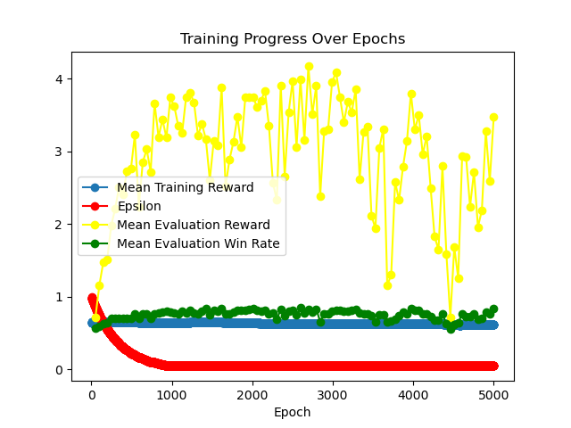
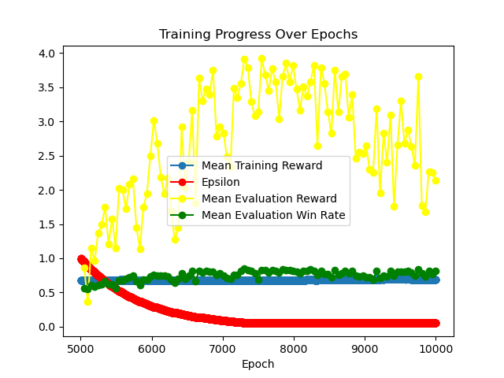
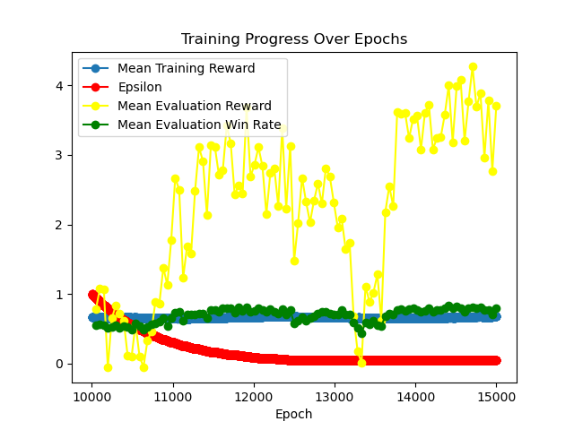

# A Multi-agent RL Environment for COUP

COUP is a multi-player poker-like bluffing game where the goal is to eliminate all other players by using deception and strategy. Players use Cards to perform actions and block others, while trying to maintain their own Cards. 

I created a partially-observable PettingZoo reinforcement-learning environment and then trained agents to play the game using a curriculum-training approach. The assets in the game are based off of previous designs from my object-oriented instantiation of the game's logic [found here](https://github.com/AlexAdrian-Hamazaki/COUP).


# Training Results

### Curriculum Training
The following graphs show the results of curriculum training. The training metrics are stored in the /metrics/pngs directory.

## Initial training against random opponent  
  

## Training against previous agent  
  

## Training against self (playing against the latest version of itself)  
  

Notably: In future versions, I likely need to train on more games to stabilize metrics.  

# Insights from the Model  

Many insights can be drawn from the actions the model chooses to make. In this case, the model has definitely learned that the most efficient option to win is to take foreign aid (a means of acquiring money) and then assassinate the other player.  
(This is likely a byproduct of the current instantiation of the game, which has yet to implement the ability to block foreign aid).  

Nevertheless, the model has learned an efficient strategy to kill the opposing player, which, given the current game rules, seems optimal to me.  

  

I've also assessed the probability of the agent winning their game based on their starting cards.  

  


As a simple analysis, a logistic regression model (see "win_rate.ipynb") shows that having a captain gave the model its highest boost in odds-ratio to win. I also modeled interaction effects to evaluate if having any 2 pair card combo contributes more to winning than just their main effects. It appears as if there are small interaction effects, indicating that different pairs of cards affect win rate differently.

### Odds Ratios for starting Cards (larger = higher win probability)

| Combination                   | Odds Ratio |
|-------------------------------|------------|
| Has_captain                   | 6.81       |
| Has_assassin                  | 6.62       |
| Has_contessa                  | 5.92       |
| Has_duke                      | 4.14       |
| Has_ambassador                | 3.92       |
| Has_ambassador : Has_contessa   | 0.25       |
| Has_duke : Has_contessa         | 0.22       |
| Has_ambassador : Has_duke       | 0.20       |
| Has_assassin : Has_duke         | 0.18       |
| Has_ambassador : Has_captain    | 0.15       |
| Has_assassin : Has_ambassador   | 0.15       |
| Has_captain : Has_duke          | 0.14       |
| Has_assassin : Has_contessa     | 0.14       |
| Has_assassin : Has_captain      | 0.12       |
| Has_captain : Has_contessa      | 0.11       |


# Usage

Basic usage of the environment is as follows. This pattern is compliant with PettingZoo environment requirements.

```python
from coup_env.coup_env import CoupEnv

env = CoupEnv(n_players=2)
env.reset(seed=42)

for agent in env.agent_iter():
    observation, reward, termination, truncation, info = env.last()
    if termination or truncation:
        action = None
    else:
        # This is where you would insert your policy
        action_mask = info['action_mask']
        action = env.action_space(agent).sample(action_mask)
    env.step(action)
env.close()